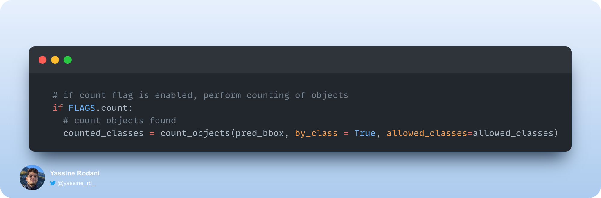

# Fish detection, tracking and counting using YOLOv4 and Darknet


This repository implements YOLOv4 using the Darknet framework for tracking and counting of 2 different fish species in an aquarium.

## ✨ Abstract

YOLO (You only look once) uses CNN to detect objects in real time. A single convolutional network simultaneously predicts multiple bounding boxes and class probabilities for those boxes. YOLO trains on full images and directly optimizes detection performance.


Three fish species that are common in aquariums belong to the genus Paracheirodon, which is a member of the family Characidae. It is native to the tropical regions of South America.

The Paracheirodon species range in size from 3 to 5 cm, are social, uninterested in other inhabitants, and living in groups of around ten individuals.

The following three members of the genus Paracheirodon are readily found in markets:

- Paracheirodon innesi
- Paracheirodon axelrodi
- Paracheirodon simulans


## 🎯 Project Aim

In this work, we propose to create a custom YOLOv4 object detector to track and count the two first classes.

1. Paracheirodon innesi, alias `neon_bleu`
2. Paracheirodon axelrodi, alias `cardinalis`

## 💻 Technologies


## 🎬 Releases

[Release v1.0](https://github.com/yassine-rd/fish-detector/releases/tag/v1.0)  
Initial release date - 27/11/2022

## 🤖 Model training

The training part of this project has been done separately using Jupyter notebook.

> TODO: jupyter notebook for model training

## 🐟 How to apply

### Getting sarted

Instructions given in this repository are meant to be used in a machine equiped with a macOS operating system (in our case we used [macOS Venture 13.0.1](https://www.apple.com/fr/macos/ventura/)). Readers should be aware that Deep Learning is very computationally intensive and therefore should have access to a computer with the minimum requirements for their project. You can consult [this](https://timdettmers.com/2018/12/16/deep-learning-hardware-guide/) guide in order to understand the requirements for using deep learning.

Scripts used in this repository are of advanced python code, if completely unfamiliarised with python
a useful familiarization with python basic knowledge, can be of great use
(more specifically: [syntax]( https://www.w3schools.com/python/python_syntax.asp),
[for loops]( https://www.w3schools.com/python/python_for_loops.asp) and
[functions]( https://www.w3schools.com/python/python_functions.asp)).

### Conda

I recommend building the tracker in an conda environment.

```bash
# Tensorflow CPU
conda env create -f conda-cpu.yml
conda activate yolov4-cpu

# Tensorflow GPU
conda env create -f conda-gpu.yml
conda activate yolov4-gpu
```

### Weights

This project's YOLOv4 weights have been already trained and can be downloaded [here](https://drive.google.com/file/d/17yiD7xVCRPZotjC0yaFAiP5wz6Umd2HW/view?usp=sharing).

After downloading the `yolov4_93map.weights` file, copy and paste it from your downloads folder into the 'data' folder of this repository.

### Running the experiment

```python
# Converting darknet weights to tensorflow
python save_model.py --weights ./data/yolov4_93map.weights --output ./checkpoints/yolov4-416 --input_size 416 --model yolov4

# Detection on images
python detect.py --weights ./checkpoints/yolov4-416 --size 416 --model yolov4 --images ./data/images/<YOUR_IMAGE>

# Tracking on videos
python detect_video.py --weights ./checkpoints/yolov4-416 --size 416 --model yolov4 --video ./data/video/<YOUR_VIDEO> --output ./detections/results.avi

# Tracking on webcam
python detect_video.py --weights ./checkpoints/yolov4-416 --size 416 --model yolov4 --video 0 --output ./detections/webcam.avi
```

> TODO: Running the detector on multiple images at once by changing the `--images` flag like such `--images "./data/images/<IMAGE_1>, ./data/images/<IMAGE_2>"`

#### Result image(s)

You can find the outputted image(s) showing the detections saved within the 'detections' folder.

<div style="text-align: center;">
    
</div>

#### Result video

Video saves wherever you point --output flag to. If you don't set the flag then your video will not be saved with detections on it.

<p style="text-align: center;">
    
</p>

### Custom YOLOv4 model

The following commands will allow you to run your custom yolov4 model.

```python
# Converting darknet weights to tensorflow
python save_model.py --weights ./data/<CUSTOM_WEIGHTS_FILE> --output ./checkpoints/custom-416 --input_size 416 --model yolov4 

# Detection on images
python detect.py --weights ./checkpoints/custom-416 --size 416 --model yolov4 --images ./data/images/<YOUR_IMAGE>

# Tracking on videos
python detect_video.py --weights ./checkpoints/custom-416 --size 416 --model yolov4 --video ./data/video/<YOUR_VIDEO> --output ./detections/results.avi

# Tracking on webcam
python detect_video.py --weights ./checkpoints/custom-416 --size 416 --model yolov4 --video 0 --output ./detections/webcam.avi
```

### Custom functions and flags

Here is how to use all the currently supported custom functions and flags.

#### Counting objects

Custom count functions are within the file [core/functions.py](https://github.com/yassine-rd/fish-detector/blob/master/core/functions.py). It can be used to count total objects found or can count number of objects detected per class.

##### Count total bbjects

To count total objects all that is needed is to add the custom flag `--count` to your `detect.py` or `detect_video.py` command.

```python
# Running the model while counting total objects detected
python detect.py --weights ./checkpoints/yolov4-416 --size 416 --model yolov4 --images ./data/images/<YOUR_IMAGE> --count
```

<p style="text-align: center;">
    
</p>

##### Count total objects per class

To count the number of objects for each individual class of your object detector you need to add the custom flag `--count` as well as change one line in the `detect.py` or `detect_video.py` script. By default the count_objects function has a parameter called `by_class` that is set to `False`. If you change this parameter to `True` it will count per class instead.

To count per class, make `detect.py` or `detect_video.py` look like this:



Then run the same command as above:

```python
# Running the model while counting objects per class
python detect.py --weights ./checkpoints/yolov4-416 --size 416 --model yolov4 --images ./data/images/<YOUR_IMAGE> --count
```

<p style="text-align: center;">
    
</p>

**Note:** You can add the `--count` flag to detect_video.py commands as well!

#### Printing detailed infos

Custom flag called ***info*** can be added to any `detect.py` or `detect_video.py` commands in order to print detailed information about each detection made by the object detector.

To print the detailed information to your command prompt, just add the flag `--info` to any of your commands. The information on each detection includes the class, confidence in the detection and the bounding box coordinates of the detection in xmin, ymin, xmax, ymax format.

If you want to edit what information gets printed you can edit the draw_bbox function found within the [core/utils.py](https://github.com/yassine-rd/fish-detector/blob/master/core/utils.py) file. The line that prints the information looks as follows:


Example of info flag added to command:

```python
# Running the model while printing informations into your command prompt
python detect.py --weights ./checkpoints/yolov4-416 --size 416 --model yolov4 --images ./data/images/<YOUR_IMAGE> --info
```

Resulting output within your shell or terminal:


**Note:** You can add the --info flag to detect_video.py commands as well!

#### Crop detections

Custom crop function within the file [core/functions.py](https://github.com/yassine-rd/fish-detector/blob/master/core/functions.py) can be applied to any `detect.py` or `detect_video.py` commands in order to crop the YOLOv4 detections and save them each as their own new image.

To crop detections all you need to do is add the `--crop` flag to any command. The resulting cropped images will be saved within the `detections/crop/` folder.

Example of crop flag added to command:

```python
# Running the model while cropping detections
python detect.py --weights ./checkpoints/yolov4-416 --size 416 --model yolov4 --images ./data/images/<YOUR_IMAGE> --crop
```

Here is an example of one of the resulting cropped detections from the above command:

<p style="text-align: center;">
    
</p>

## 📝 CLI args reference

```bash
save_model.py:
  --weights: path to weights file
    (default: './data/yolov4.weights')
  --output: path to output
    (default: './checkpoints/yolov4-416')
  --[no]tiny: yolov4 or yolov4-tiny
    (default: 'False')
  --input_size: define input size of export model
    (default: 416)
  --framework: what framework to use (tf, tflite)
    (default: tf)
  --model: yolov3 or yolov4
    (default: yolov4)

detect.py:
  --images: path to input images as a string with images separated by ","
    (default: './data/images/kite.jpg')
  --output: path to output folder
    (default: './detections/')
  --[no]tiny: yolov4 or yolov4-tiny
    (default: 'False')
  --weights: path to weights file
    (default: './checkpoints/yolov4-416')
  --framework: what framework to use (tf, tflite)
    (default: tf)
  --model: yolov3 or yolov4
    (default: yolov4)
  --size: resize images to
    (default: 416)
  --iou: iou threshold
    (default: 0.45)
  --score: confidence threshold
    (default: 0.25)
  --count: count objects within images
    (default: False)
  --dont_show: dont show image output
    (default: False)
  --info: print info on detections
    (default: False)
  --crop: crop detections and save as new images
    (default: False)
    
detect_video.py:
  --video: path to input video (use 0 for webcam)
    (default: './data/video/video.mp4')
  --output: path to output video (remember to set right codec for given format. e.g. XVID for .avi)
    (default: None)
  --output_format: codec used in VideoWriter when saving video to file
    (default: 'XVID')
  --[no]tiny: yolov4 or yolov4-tiny
    (default: 'false')
  --weights: path to weights file
    (default: './checkpoints/yolov4-416')
  --framework: what framework to use (tf, tflite)
    (default: tf)
  --model: yolov3 or yolov4
    (default: yolov4)
  --size: resize images to
    (default: 416)
  --iou: iou threshold
    (default: 0.45)
  --score: confidence threshold
    (default: 0.25)
  --count: count objects within video
    (default: False)
  --dont_show: dont show video output
    (default: False)
  --info: print info on detections
    (default: False)
  --crop: crop detections and save as new images
    (default: False)
```

## 💬 Contact

Reach out to [@yassine_rd_](https://twitter.com/yassine_rd_) on Twitter or feel free to contact yassine.rodani@gmail.com

## 🔑 Licence

This project is licensed under the MIT License.

MIT ©Yassine RODANI.

See the [LICENSE](https://github.com/yassine-rd/fish-detector/blob/master/LICENSE) file for more details.

## 🌐 References

- [The AI Guy](https://github.com/theAIGuysCode)
- [AlexeyAB Darknet Repo](https://github.com/AlexeyAB/darknet)
- [YOLOv4 Paper](https://arxiv.org/abs/2004.10934v1)
- [hunglc007](https://github.com/hunglc007?tab=repositories)

## 📜 Cite

```markdown
@misc{darknet13,
  author =   {Joseph Redmon},
  title =    {Darknet: Open Source Neural Networks in C},
  howpublished = {\url{http://pjreddie.com/darknet/}},
  year = {2013--2016}
}
```
